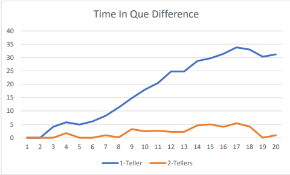

# Bank-Teller-Simulation
How much of a difference does 2 tellers make at a bank versus just 1?

In this project - we were given the first 2 columns of this data-set and told to compute the remaining columns. Additionaly, for the analysis of the data-set I thought it important to calculate the time between each customer arrival. This is important because if we ever want to create another data-set we can maintain a constant 'time-between customer arrival' which is really how busy it is.

After completing this we are told to produce our own data-set and to see the effects of 1 teller versus 2. 

I wanted to produce a data-set that was the same as the first but perhaps changed around slightly. However, what I did want to do was to make it twice as busy. The results of the first data-set to the ones that I made are seen here. We see a higher frequency in mine, but the slope remains the same. Thus accomplishment achieved.

Now, we simply let matlab calculate the time it takes the teller to go through each customer for 1 teller.

As you can tell, 20 minutes is the average weight time in Q for each customer. Which isn't too suprising of a number considering that customers enter the bank every 1 and a half minutes and it takes customers anywhere between 2-5 minutes to be served, thus the minute accumulate quite quickly.

Now we can see a staggering difference for 2 tellers.

We've now gone down to 2 minutes in Q time by adding just 1 teller.

The question now remains: How many tellers should we place? That depends on what your budge is and a bunch of different factors. More basically I would say, If the Q time for each customer is at 0 minutes, this would be ideal, but perhaps not cost efficient. If the customers can wait 1-2 minutes each on a busy day, then I know I'm doing something right. Too long Q time and I don't have enough tellers, and too little, then too many tellers are sitting around.

Here is the easy to read and understand comparison of the 1 teller vs 2 using EXCEL

